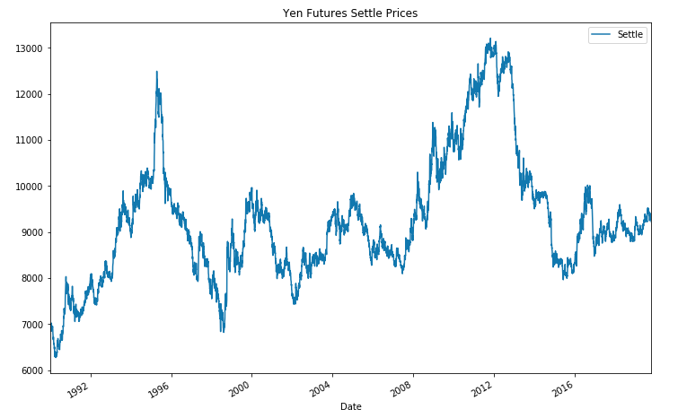
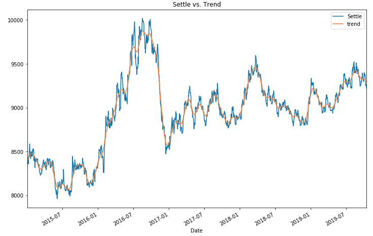
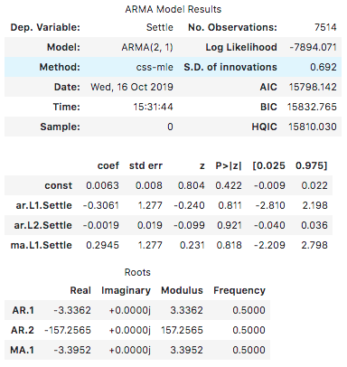
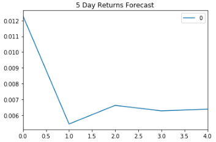
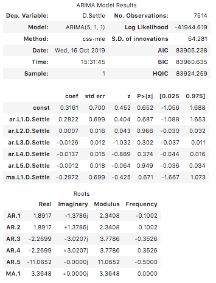
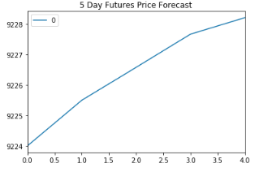
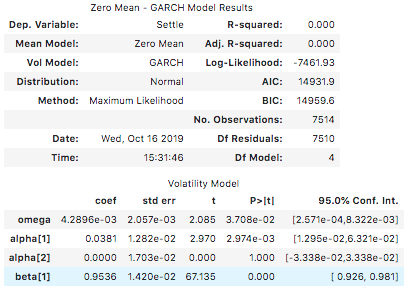
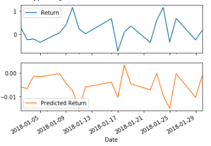

# Time Seriers Analysis
Time Series Forecasting and Linear Regression Modeling analysis for Japanese Yen

## Background

The financial departments of large companies often deal with foreign currency transactions while doing international business. As a result, they are always looking for anything that can help them better understand the future direction and risk of various currencies. Hedge funds, too, are keenly interested in anything that will give them a consistent edge in predicting currency movements.

### Time-Series Forecasting

loaded historical Dollar-Yen exchange rate futures data and ploted Yen futures settle prices.

#### Using a Hodrick-Prescott Filter, decomposed the Settle price into a trend and noise. and ploted settle Vs trend 

#### Using futures Settle *Returns*, estimated an ARMA model using Sklearn.

#### Plot for 5 Day Returns Forecast from ARMA model

#### Question: Based on the p-value, is the model a good fit?

Answer: Based on the model summary table, none of the p-values are below 0.05, which suggests that we may need to add additional input variables or adjust the lag order.

Assuming we were confident with this model's ability to predict, however, our model-based forecast for the next 5 days is of positive returns for the Yen.

### Forecasting the Settle Price using an ARIMA Model

Using the *raw* Yen **Settle Price**, estimated an ARIMA model.

#### Plot for 5 Day Futures Price Forecast

# Volatility Forecasting with GARCH

Using futures Settle *Returns*, estimated an GARCH model

Covariance estimator: robust

Note, our p-values for GARCH and volatility forecasts tend to be much lower than our ARMA/ARIMA return and price forecasts. In particular, here we have all p-values of less than 0.05, except for alpha(2), indicating overall a much better model performance.

#### Linear Regression Forecasting

1. built a SKLearn linear regression model to predict Yen futures ("settle") returns with *lagged* Yen futures returns. 
2. Fitting a Linear Regression Model.
3. Making predictions using the testing data.
4. Out-of-sample performance.
5. In-sample performance.

#### The first 20 predictions vs the true values

#Please check *conclusions.md* to read the full Analysis

